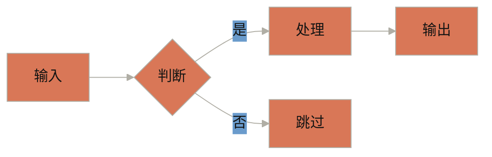

# Anthropic Design Style Skill

当用户希望以 Anthropic / Claude 的风格进行图表绘制、UI 设计或可视化沟通时，激活此 Skill。

---

## 核心设计哲学

Anthropic 的设计基于以下三条核心信念：

1. **清晰胜于炫技（Clarity over complexity）** —— 每一个视觉元素都应该服务于理解，而非展示技术。
2. **温暖与专业并存（Warm professionalism）** —— 用柔和的大地色调和衬线+无衬线字体组合，传递有温度的信任感。
3. **人文与技术融合（Human-centered technical storytelling）** —— 即使是技术架构图，也要让非技术读者能感受到叙事的逻辑。

**产品设计流程：**
- 原型优先（Prototype First）：快速制作可交互原型，而非写长篇规格文档
- 大量内部测试（Dogfooding）：基于真实使用反馈迭代，而非假设
- 自下而上（Bottom-up）：随模型能力升级而灵活调整产品形态

---

## 品牌色彩系统

### 主色（Main Colors）

| 名称       | Hex       | 用途                         |
|------------|-----------|------------------------------|
| Dark       | `#141413` | 正文文字、深色背景            |
| Light      | `#faf9f5` | 浅色背景、深色底上的文字      |
| Mid Gray   | `#b0aea5` | 次要元素、说明文字            |
| Light Gray | `#e8e6dc` | 微妙背景、分隔线              |

### 强调色（Accent Colors，用于图形而非文字）

| 名称   | Hex       | 含义          |
|--------|-----------|---------------|
| Orange | `#d97757` | 主强调色，活力、重点 |
| Blue   | `#6a9bcc` | 次强调色，冷静、信息 |
| Green  | `#788c5d` | 第三强调色，自然、平衡 |

**使用规则：**
- 强调色**轮换使用**（非全部同时出现），形成视觉节奏
- 深色背景上用 Light（`#faf9f5`）作为文字色
- 图表节点背景用强调色，边框用 Dark 或 Mid Gray

---

## 字体系统

| 场景             | 字体首选  | 回退字体 |
|------------------|-----------|----------|
| 标题（≥24pt）    | Poppins   | Arial    |
| 正文             | Lora      | Georgia  |
| 数据 / 代码      | Monospace | Courier  |

**原则：**
- 标题用无衬线（Poppins）—— 现代、清晰
- 正文用衬线（Lora）—— 温暖、可读
- 数据/指标用等宽字体 —— 精确、对齐

---

## 图表工具选择指南

根据内容类型选择最合适的图表格式：

### 1. Mermaid（推荐首选）
适合：流程图、序列图、状态机、ER 图、架构总览

```
优点：结构化清晰、可版本控制、Claude 原生支持
风格主题建议：default（贴近 Anthropic 色调）或自定义
```

**Mermaid 风格模板：**


### 2. SVG（需要精确控制时）
适合：图标、品牌插图、精确排版的说明图

```
优点：无限缩放、可嵌入 HTML/Markdown、Claude 可直接生成 XML
色彩：使用上方品牌色系
风格：线条简洁，填充使用强调色，描边用 #b0aea5
```

### 3. Excalidraw JSON（概念性草图）
适合：头脑风暴图、架构概念图、白板风格演示

```
优点：手绘感亲切、适合早期设计阶段、Claude 可生成 JSON
风格：圆角矩形 + 手写线条 + 强调色节点
```

### 4. Draw.io XML
适合：正式文档、跨团队协作、需要导出 PDF 的场景

### 5. D3.js / Chart.js / Plotly（互动图表）
适合：数据可视化、实时更新图表、Claude Artifacts 中的互动仪表盘

---

## 视觉设计原则

### 层次结构（Visual Hierarchy）
- 用**尺寸**区分主次：重要节点更大
- 用**颜色权重**引导视线：橙色 → 蓝色 → 绿色 → 灰色
- 用**位置**暗示逻辑：从左到右 = 时间流，从上到下 = 层级深入

### 格式塔原则（Gestalt Principles）
- **接近性**：相关元素靠近摆放
- **相似性**：同类节点用相同颜色/形状
- **连续性**：用有方向的线条引导阅读流程

### 可访问性（Accessibility）
- 前景与背景对比度 ≥ 4.5:1
- 不单独依赖颜色传递信息（配合形状或标签）
- 图表必须有文字说明（caption）

### 克制原则（Restraint）
- ❌ 避免：发光效果、霓虹色、emoji 滥用、过度阴影
- ✅ 推荐：暖色调、衬线标题、等宽数据字体、留白

---

## 图表生成工作流

当用户请求生成图表时，按以下步骤执行：

### 步骤 1：判断图表类型
询问或推断：
- 展示**流程/逻辑** → Mermaid flowchart / sequence
- 展示**数据/趋势** → Chart.js 或 Plotly
- 展示**架构/系统** → Mermaid + draw.io 备选
- 展示**概念/草图** → Excalidraw
- 展示**品牌/插图** → SVG

### 步骤 2：应用 Anthropic 品牌色
- 节点填充：从 Orange / Blue / Green 轮换选择
- 文字：Dark (`#141413`) 或 Light (`#faf9f5`)
- 背景：Light (`#faf9f5`)
- 边框/线条：Mid Gray (`#b0aea5`)

### 步骤 3：设定字体
- 标题：Poppins（或 Arial 回退）
- 说明：Lora（或 Georgia 回退）

### 步骤 4：遵循克制美学
- 无发光、无霓虹
- 圆角矩形优先（8-12px radius）
- 充足留白
- 箭头简洁有向

### 步骤 5：附上文字说明
每张图表下方提供：
- 图表标题
- 1-2 句说明图表核心信息

---

## 提示词模板

生成 Anthropic 风格图表时，使用类似下方的提示结构：

```
请用 Anthropic 设计风格生成一张 [Mermaid/SVG/Excalidraw] 图表，主题是 [XXX]。

风格要求：
- 色彩：使用 #d97757（橙）、#6a9bcc（蓝）、#788c5d（绿）强调色，背景 #faf9f5
- 文字：标题 Poppins，正文 Lora
- 风格：简洁克制，无发光无霓虹，充足留白
- 层级：用颜色和大小区分主次节点
```

---

## 参考资源

- Anthropic 品牌色规范：基于公开 GitHub 和 MCP 工具文档整理
- 字体：[Poppins](https://fonts.google.com/specimen/Poppins) · [Lora](https://fonts.google.com/specimen/Lora)
- 图表工具：[Mermaid](https://mermaid.js.org) · [Excalidraw](https://excalidraw.com) · [draw.io](https://app.diagrams.net)
- Anthropic 研究博客：[anthropic.com/research](https://www.anthropic.com/research)（参考图表风格）
- 灵感来源：Anthropic "Mapping the Mind of a Large Language Model"（2024）图表样式

---

## 注意事项

- 此 Skill 基于公开信息整理，非 Anthropic 官方设计规范
- 色彩和字体规格来源于 Anthropic 品牌指南的公开引用
- 用于个人创作、文档制作和学习目的
